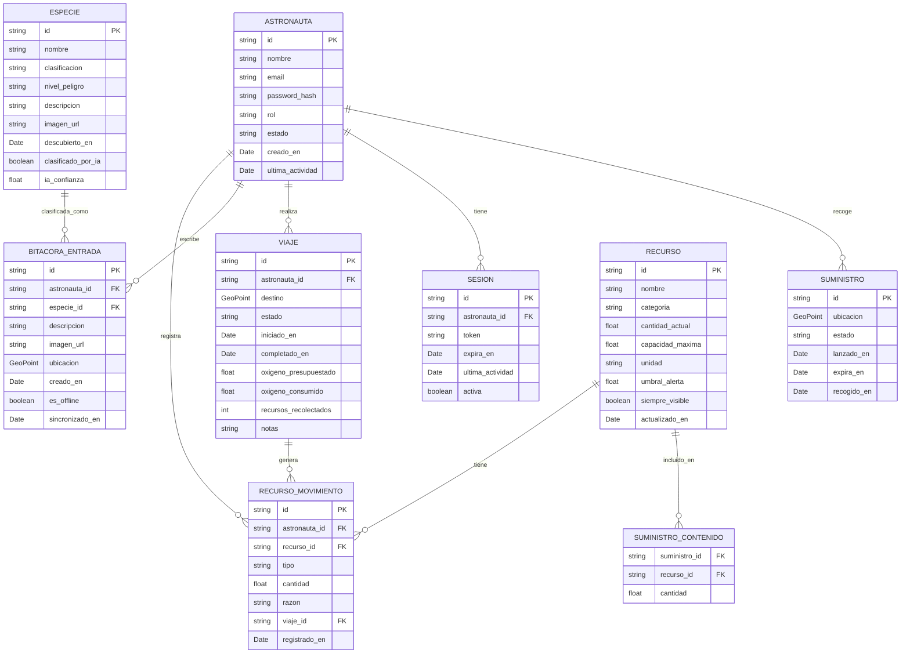
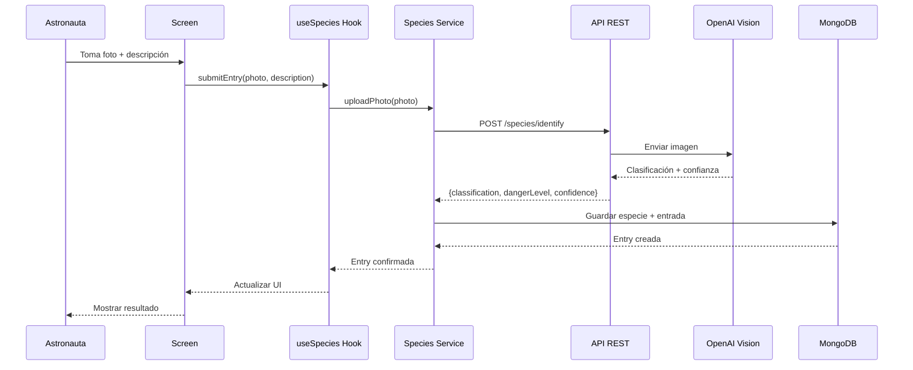
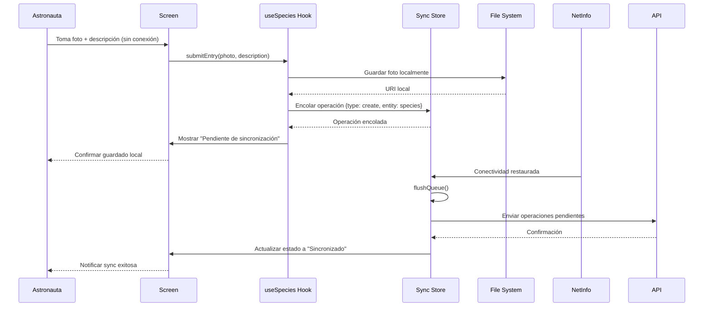
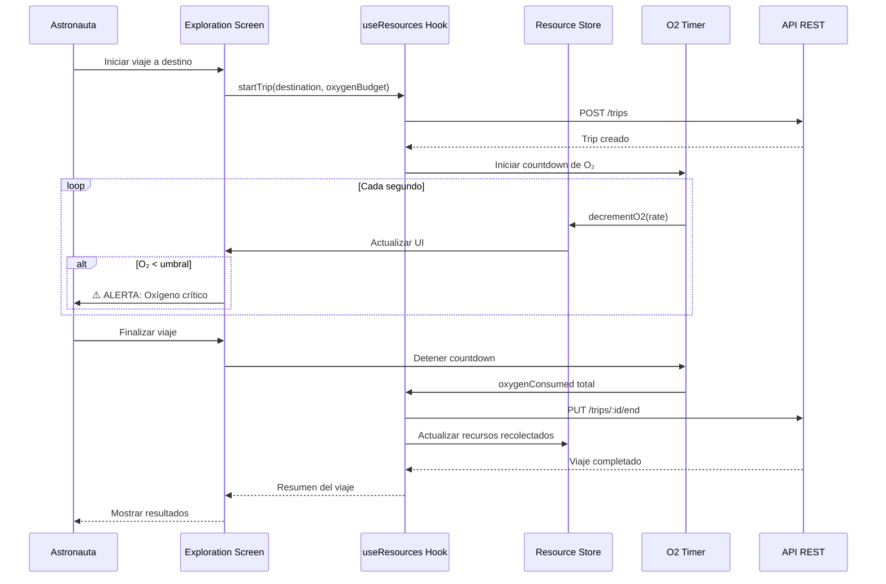
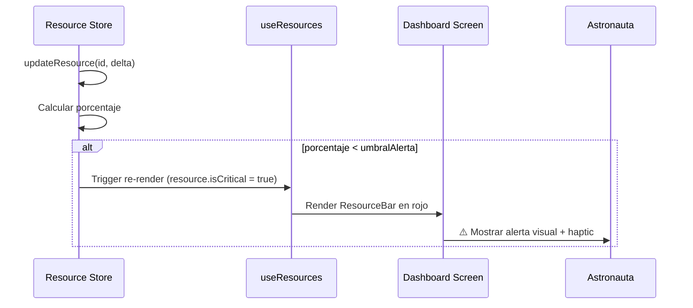

# Astro_Beacon — Diseño de Datos

**EIF411 — Diseño y Programación de Plataformas Móviles**
**Fase:** Base Inicial (Entrega 1)
**Fecha:** Abril 2026

---

## Tabla de Contenidos

1. [Diagrama ER](#1-diagrama-er)
2. [Entidades](#2-entidades)
3. [Relaciones](#3-relaciones)
4. [Estrategia Offline Sync](#4-estrategia-offline-sync)
5. [Diagramas de Flujo de Datos](#5-diagramas-de-flujo-de-datos)
6. [Reglas de Validación](#6-reglas-de-validación)
7. [Decisiones de Diseño](#7-decisiones-de-diseño)

---

## 1. Diagrama ER

---

## 2. Entidades

### 2.1 Astronauta (User)

**Propósito:** Usuario principal del sistema. Representa al astronauta varado en el planeta.

| Atributo | Tipo | Descripción |
|----------|------|-------------|
| `id` | `string (UUID)` | Identificador único |
| `nombre` | `string` | Nombre del astronauta |
| `email` | `string` | Correo electrónico (login) |
| `passwordHash` | `string` | Hash de contraseña (bcrypt) |
| `rol` | `enum` | `astronaut`, `control_mision` |
| `estado` | `enum` | `activo`, `inactivo`, `emergencia` |
| `baseCampLocation` | `GeoPoint` | Ubicación del campamento base |
| `creadoEn` | `Date` | Fecha de registro |
| `ultimaActividad` | `Date` | Último acceso |

**Requerimiento:** Generales #2 (seguridad), Bitácora #1

---

### 2.2 Recurso (Resource)

**Propósito:** Inventario de recursos de supervivencia. Define qué recursos existen y sus límites.

| Atributo | Tipo | Descripción |
|----------|------|-------------|
| `id` | `string (UUID)` | Identificador único |
| `nombre` | `string` | Nombre del recurso (Oxígeno, Agua, etc.) |
| `categoria` | `enum` | `oxigeno`, `agua`, `comida`, `medico`, `equipo`, `otro` |
| `cantidadActual` | `number` | Cantidad disponible |
| `capacidadMaxima` | `number` | Capacidad máxima del recurso |
| `unidad` | `string` | Unidad de medida (`%`, `L`, `kg`, `unidades`) |
| `umbralAlerta` | `number` | Porcentaje que activa alerta (default: 15%) |
| `siempreVisible` | `boolean` | Si debe mostrarse siempre en el HUD |
| `actualizadoEn` | `Date` | Última actualización |

**Requerimiento:** Gestión de recursos #1, #2, #3

---

### 2.3 RecursoMovimiento (ResourceMovement)

**Propósito:** Registro histórico de ingresos y egresos de recursos. Trazabilidad completa.

| Atributo | Tipo | Descripción |
|----------|------|-------------|
| `id` | `string (UUID)` | Identificador único |
| `astronautaId` | `string → Astronauta (FK)` | Quién registró |
| `recursoId` | `string → Recurso (FK)` | Recurso afectado |
| `tipo` | `enum` | `ingreso`, `egreso` |
| `cantidad` | `number` | Cantidad movida |
| `razon` | `string` | Motivo del movimiento |
| `viajeId` | `string → Viaje (FK, nullable)` | Viaje asociado (si aplica) |
| `registradoEn` | `Date` | Fecha del registro |

**Requerimiento:** Gestión de recursos #3 (registro de ingresos y egresos)

---

### 2.4 Especie (Species)

**Propósito:** Catálogo de formas de vida descubiertas. Clasificación automática por IA.

| Atributo | Tipo | Descripción |
|----------|------|-------------|
| `id` | `string (UUID)` | Identificador único |
| `nombre` | `string` | Nombre ("Desconocido" hasta clasificar) |
| `clasificacion` | `enum` | `animal`, `planta`, `recurso`, `microorganismo`, `desconocido`, `otro` |
| `nivelPeligro` | `enum` | `amigable`, `cauteloso`, `peligroso`, `letal` |
| `descripcion` | `string` | Descripción del descubrimiento |
| `imagenUrl` | `string` | URL de la foto tomada |
| `descubiertoEn` | `Date` | Fecha del descubrimiento |
| `clasificadoPorIA` | `boolean` | Si fue clasificado automáticamente |
| `iaConfianza` | `number (0-1)` | Nivel de confianza de la IA |

**Requerimiento:** Bitácora #1 (clasificación automática)

---

### 2.5 BitacoraEntrada (LogbookEntry)

**Propósito:** Registro fotográfico de descubrimientos. Entrada principal de la bitácora.

| Atributo | Tipo | Descripción |
|----------|------|-------------|
| `id` | `string (UUID)` | Identificador único |
| `astronautaId` | `string → Astronauta (FK)` | Quién registró |
| `especieId` | `string → Especie (FK, nullable)` | Especie clasificada (null si pendiente) |
| `descripcion` | `string` | Descripción breve del astronauta |
| `imagenUrl` | `string` | URI local o URL remota de la foto |
| `ubicacion` | `GeoPoint` | Coordenadas GPS del hallazgo |
| `creadoEn` | `Date` | Fecha de creación |
| `esOffline` | `boolean` | Si se creó sin conexión |
| `sincronizadoEn` | `Date (nullable)` | Fecha de sync al servidor |

**Requerimiento:** Bitácora #1, #4 (offline)

---

### 2.6 Viaje (Trip)

**Propósito:** Expediciones de búsqueda de recursos. Tracking de consumo de oxígeno.

| Atributo | Tipo | Descripción |
|----------|------|-------------|
| `id` | `string (UUID)` | Identificador único |
| `astronautaId` | `string → Astronauta (FK)` | Astronauta que viaja |
| `destino` | `GeoPoint` | Coordenadas del destino |
| `estado` | `enum` | `planificado`, `activo`, `completado`, `abortado` |
| `iniciadoEn` | `Date (nullable)` | Fecha de inicio |
| `completadoEn` | `Date (nullable)` | Fecha de finalización |
| `oxigenoPresupuestado` | `number` | Oxígeno planificado para el viaje |
| `oxigenoConsumido` | `number` | Oxígeno realmente consumido |
| `recursosRecolectados` | `number` | Cantidad de recursos obtenidos |
| `notas` | `string` | Observaciones del viaje |

**Requerimiento:** Recursos y viajes #1, #2, #3

---

### 2.7 Suministro (SupplyDrop)

**Propósito:** Suministros enviados por la NASA con ubicación GPS.

| Atributo | Tipo | Descripción |
|----------|------|-------------|
| `id` | `string (UUID)` | Identificador único |
| `ubicacion` | `GeoPoint` | Coordenadas GPS del suministro |
| `estado` | `enum` | `pendiente`, `entregado`, `recogido`, `expirado` |
| `contenido` | `RecursoItem[]` | Array de `{recursoId, cantidad}` |
| `lanzadoEn` | `Date` | Fecha de envío |
| `expiraEn` | `Date` | Fecha de expiración |
| `recogidoEn` | `Date (nullable)` | Fecha de recolección |

**Requerimiento:** Recursos y viajes #1 (suministros con GPS)

---

### 2.8 Sesion (Session)

**Propósito:** Gestión de autenticación y session timeout por inactividad.

| Atributo | Tipo | Descripción |
|----------|------|-------------|
| `id` | `string (UUID)` | Identificador único |
| `astronautaId` | `string → Astronauta (FK)` | Usuario de la sesión |
| `token` | `string` | JWT token |
| `expiraEn` | `Date` | Expiración del token |
| `ultimaActividad` | `Date` | Última interacción del usuario |
| `activa` | `boolean` | Si la sesión está vigente |

**Requerimiento:** Seguridad, control de acceso y sesión

---

## 3. Relaciones

| Relación | Tipo | Descripción |
|----------|------|-------------|
| Astronauta → RecursoMovimiento | 1:N | Un astronauta registra muchos movimientos |
| Astronauta → BitacoraEntrada | 1:N | Un astronauta escribe muchas entradas |
| Astronauta → Viaje | 1:N | Un astronauta realiza muchos viajes |
| Astronauta → Sesion | 1:N | Un astronauta tiene múltiples sesiones |
| Recurso → RecursoMovimiento | 1:N | Un recurso tiene muchos movimientos |
| Especie → BitacoraEntrada | 1:N | Una especie aparece en muchas entradas |
| Viaje → RecursoMovimiento | 1:N | Un viaje genera muchos movimientos |
| Suministro ↔ Recurso | N:M | Vía tabla intermedia SuministroContenido |

---

## 4. Estrategia Offline Sync

### 4.1 Caché de Lectura

| Entidad | Caché Offline | Estrategia |
|---------|--------------|------------|
| **Especie** | ✅ Sí | Caché completo del catálogo. `staleTime: Infinity` cuando offline |
| **Recurso** | ✅ Sí | Zustand store con persist en AsyncStorage |
| **Suministro** | ✅ Sí | Últimos suministros conocidos, GPS local |
| **BitacoraEntrada** | ✅ Sí | Todas las entradas locales (creadas online + offline) |
| **Viaje** | ✅ Sí | Viaje activo persistido localmente |
| **Sesion** | ✅ Sí | Token en expo-secure-store |

### 4.2 Cola de Escritura Offline

| Operación | Cuando Offline | Acción |
|-----------|---------------|--------|
| Crear BitacoraEntrada | ✅ Cola | Guardar local con `esOffline: true`, encolar sync |
| Registrar RecursoMovimiento | ✅ Cola | Actualizar store local, encolar sync |
| Iniciar/Completar Viaje | ✅ Cola | Persistir estado local, encolar sync |
| Login | ❌ Bloqueado | Requiere conexión para autenticación |
| Clasificar Especie (IA) | ❌ Diferido | Guardar foto, clasificar al reconectar |

### 4.3 Resolución de Conflictos

| Escenario | Estrategia |
|-----------|-----------|
| Misma entrada editada offline y online | **Last-write-wins** por timestamp `creadoEn` |
| Recursos modificados en ambos lados | **Merge**: sumar ingresos, restar egresos |
| Viaje activo desconectado | **Persistir local**: al reconectar, enviar estado final |
| Duplicados por retry | **Idempotencia**: verificar por `id` antes de insertar |

### 4.4 Almacenamiento Local

| Tipo de Dato | Tecnología | Justificación |
|-------------|-----------|---------------|
| Estado global (recursos, auth) | Zustand + AsyncStorage | Simple, reactivo, persist integrado |
| Cola de sync offline | Zustand store + persist | Array serializable, fácil de flush |
| Fotos tomadas offline | expo-file-system | Archivos grandes, no AsyncStorage |
| Tokens de sesión | expo-secure-store | Cifrado nativo del dispositivo |
| Catálogo de especies (caché) | AsyncStorage | Datos estructurados pequeños |

---

## 5. Diagramas de Flujo de Datos

### 5.1 Crear entrada de bitácora (Online)

### 5.2 Crear entrada de bitácora (Offline)

### 5.3 Inicio y completado de viaje

### 5.4 Flujo de alerta de recursos

---

## 6. Reglas de Validación

### 6.1 Astronauta

| Regla | Validación |
|-------|-----------|
| Email requerido | Formato email válido |
| Password requerido | Mínimo 8 caracteres |
| Nombre requerido | Mínimo 2 caracteres |
| Rol válido | `astronaut` o `control_mision` |

### 6.2 Recurso

| Regla | Validación |
|-------|-----------|
| `cantidadActual` >= 0 | No puede ser negativo |
| `cantidadActual` <= `capacidadMaxima` | No exceder capacidad |
| `umbralAlerta` entre 0-100 | Porcentaje válido |
| `unidad` requerido | No vacío |
| `siempreVisible` | Booleano |

### 6.3 RecursoMovimiento

| Regla | Validación |
|-------|-----------|
| `cantidad` > 0 | Movimiento debe ser positivo |
| `recursoId` existe | FK válida |
| `tipo` válido | `ingreso` o `egreso` |
| Si `tipo` = `egreso`: `cantidad` <= `recurso.cantidadActual` | No puede egresar más de lo disponible |

### 6.4 Especie

| Regla | Validación |
|-------|-----------|
| `clasificacion` válido | Uno de los 6 enums definidos |
| `nivelPeligro` válido | Uno de los 4 enums definidos |
| `iaConfianza` entre 0-1 | Si `clasificadoPorIA` = true |
| `imagenUrl` requerido | No vacío |
| `descripcion` requerido | Mínimo 10 caracteres |

### 6.5 BitacoraEntrada

| Regla | Validación |
|-------|-----------|
| `descripcion` requerido | Mínimo 10 caracteres |
| `imagenUrl` requerido | No vacío |
| `ubicacion` requerido | `{lat, lng}` válidos |
| Si `especieId` presente: debe existir | FK válida |

### 6.6 Viaje

| Regla | Validación |
|-------|-----------|
| `oxigenoPresupuestado` > 0 | Debe planificar oxígeno |
| `oxigenoConsumido` >= 0 | No negativo |
| `oxigenoConsumido` <= `oxigenoPresupuestado` | No exceder presupuesto (warning, no error) |
| `destino` requerido | `{lat, lng}` válidos |
| No puede completar sin `iniciadoEn` | Debe haber iniciado primero |
| `recursosRecolectados` >= 0 | No negativo |

### 6.7 Suministro

| Regla | Validación |
|-------|-----------|
| `ubicacion` requerido | `{lat, lng}` válidos |
| `contenido` no vacío | Al menos un recurso |
| `expiraEn` > `lanzadoEn` | Expiración debe ser posterior |
| Si `recogidoEn` presente: debe ser > `lanzadoEn` | Coherencia temporal |

### 6.8 Sesion

| Regla | Validación |
|-------|-----------|
| `token` requerido | JWT válido |
| `expiraEn` > `ultimaActividad` | Expiración coherente |
| Session expira si `now > expiraEn` | Auto-logout |
| Session expira si `now - ultimaActividad > timeout` | Timeout por inactividad |

---

## 7. Decisiones de Diseño

### 7.1 GeoPoint Pattern

Todas las coordenadas GPS usan un objeto `{lat: number, lng: number}` en lugar de campos separados. Esto:
- Mantiene consistencia entre entidades (Suministro, Viaje, BitacoraEntrada)
- Facilita el cálculo de distancias (Haversine formula)
- Compatible con GeoJSON si se necesita integración con mapas

### 7.2 Clasificación por IA

- `clasificadoPorIA: boolean` indica si la clasificación fue automática o manual
- `iaConfianza: number (0-1)` permite al astronauta validar/corregir la clasificación
- Si `iaConfianza < 0.5`, se marca como "Desconocido" y requiere clasificación manual
- Cumple el requerimiento de "decisiones automatizadas explicables" del curso

### 7.3 Offline-First para Bitácora

- Las fotos se guardan localmente con `expo-file-system` inmediatamente
- La entrada se crea con `esOffline: true` y se encola en el sync store
- Al reconectar, se envía la foto al servidor y se obtiene la clasificación IA
- `sincronizadoEn` registra cuándo se completó la sync

### 7.4 Consumo de Oxígeno en Viajes

- Se usa un timer en el UI thread (Reanimated) para countdown visual
- El consumo real se calcula como: `oxigenoConsumido = tiempoTranscurrido * tasaConsumo`
- Si la app va a background, se pausa el timer y se guarda el timestamp
- Al volver a foreground, se recalcula el consumo basado en tiempo real transcurrido

### 7.5 Enums vs. Tablas de Referencia

Se usan enums en lugar de tablas de referencia para clasificaciones porque:
- Son valores fijos definidos por el estudiante (requerimiento del curso)
- No cambian en runtime
- Más simples de validar con Zod
- Se pueden extender en futuras versiones

---

*Documento elaborado como parte de la Entrega 1 — Base Inicial (10%)*
*EIF411 — Diseño y Programación de Plataformas Móviles — UNACR*
